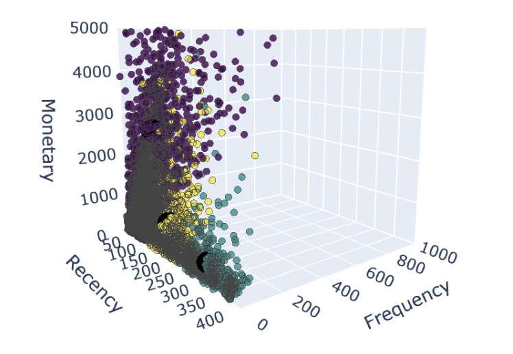

# Introduction
In today's competitive e-commerce landscape, understanding customer behavior is essential for driving sales and fostering loyalty. RFM (Recency, Frequency, Monetary) analysis allows businesses to categorize customers based on purchasing patterns, identifying high-value segments and those at risk of disengagement. By leveraging these insights, e-commerce companies can tailor their marketing strategies, offering personalized promotions and targeting different customer groups based on their needs. This approach enhances customer engagement and optimizes marketing efforts, ultimately leading to improved sales performance and long-term growth.

## Objectives
I aim to explore the transactional dataset with RFM analysis and further classify the customers to gain business insight. By analyzing the customer data, we intend to:
* Identify high-value customer segments for targeted marketing campaigns.
* Develop personalized engagement strategies to nurture customer relationships.
* Implement effective retention tactics to reduce customer churn.
* Optimize marketing resource allocation by focusing on high-potential customer segments.
* Gain a deeper understanding of customer preferences and trends.

## Dataset
This is transactional data collected between 01/12/2010 and 09/12/2011 for a UK-based and registered non-store online retail. The company mainly sells unique all-occasion gifts. Many customers of the company are wholesalers." The data is obtained from The UCI Machine Learning Repository. Here is the link: https://archive.ics.uci.edu/dataset/352/online+retail

Variables Information 
* InvoiceNo: a 6-digit integral number uniquely assigned to each transaction. If this code starts with letter 'c', it indicates a cancellation
* StockCode: a 5-digit integral number uniquely assigned to each distinct product
* Description: product name
* Quantity: the quantities of each product (item) per transaction
* InvoiceDate: the day and time when each transaction was generated
* UnitPrice: product price per unit. Unit in sterling
* CustomerID: a 5-digit integral number uniquely assigned to each customer

## RFM Analysis
RFM analysis is a common marketing technique to use data based on existing customer transactional data to predict consumer behavior. RFM stands for Recency, Frequency, and Monetary value. The three factors are key metrics for discovering customer's preferences and habits. 

* Recency: the time elapsed since a customer's last purchase, indicating how recently they engaged with the brand.

* Frequency: the number of purchases a customer has made, providing a measure of customer loyalty and engagement.

* Monetary value: the total amount a customer has spent, reflecting their overall contribution to revenue.

With RFM analysis, businesses can leverage customer insights to develop effective marketing campaigns by targeting specific groups of existing customers. This approach not only helps identify high-value and loyal customer segments but also allows businesses to concentrate their efforts on retaining and nurturing these relationships. Ultimately, RFM analysis empowers companies to enhance customer engagement and drive sustainable growth.

## K-Means Cluster
I employ K-Means clustering to categorize customers based on their RFM scores. Given that K-Means clustering is sensitive to the magnitude of the data, it is essential to normalize the RFM score before fitting the clustering. To achieve this, I use MinMaxScaler, which scales the RFM scores between 0 and 1. Subsequently, I divided customers into three categories based on their RFM characteristics: 

#### Loyal Customers (Low Recency, Mid to High Frequency, High Monetary)

These customers make frequent purchases and spend significantly. Their recent purchasing behavior indicates strong engagement and satisfaction with the e-commerce platform. 

These customers represent a substantial portion of revenue for the business. Strategies should focus on retaining their loyalty through rewards programs, exclusive offers, and personalized communication. Ensuring that they receive exceptional service will help maintain their commitment to the brand.

#### Targeted Customers (Mid Recency, Low Frequency, Mid Monetary)

These wholesale customers have previously demonstrated good spending habits but have not made purchases recently. Their frequency of purchases is lower compared to loyal customers, but they still hold potential value.

This group requires targeted marketing strategies to re-engage them. Tailored advertisements, special promotions, and personalized outreach can incentivize them to return and make purchases again. The focus should be on understanding their past preferences and addressing any potential barriers that might prevent them from shopping again.

#### Potential Customers (High Recency, Low Frequency, Low Monetary)

This cluster includes customers who have not made a purchase for a long time and whose spending is minimal. They may have shown some interest recently but have yet to establish a significant purchasing history.

These customers need a strategic approach to regain their interest and trust in the e-commerce platform. Efforts could include engaging content, educational resources about products, and introductory offers to encourage their first significant purchases. It's important to identify reasons for their inactivity, whether it's related to pricing, product availability, or competition, and address those concerns proactively.

